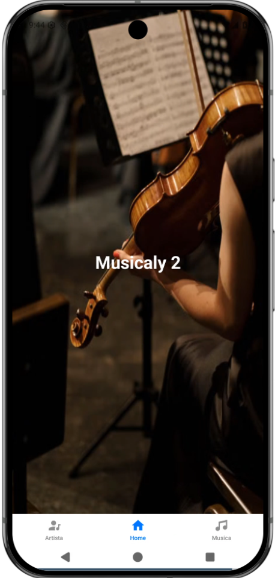
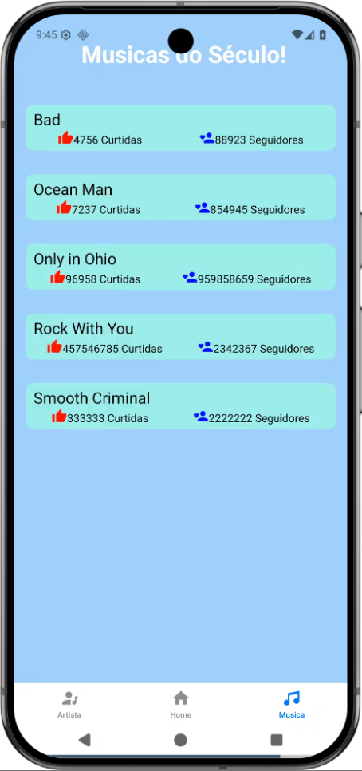
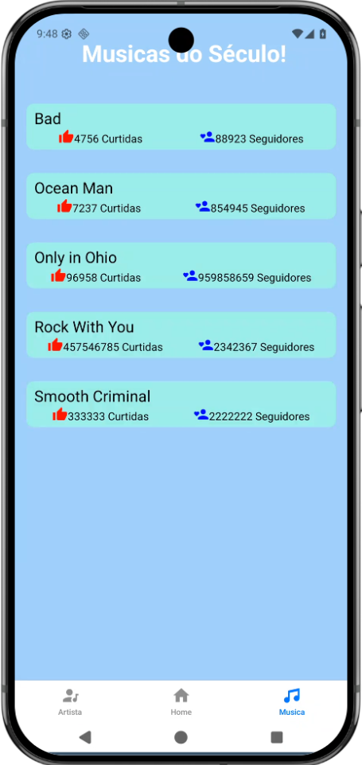
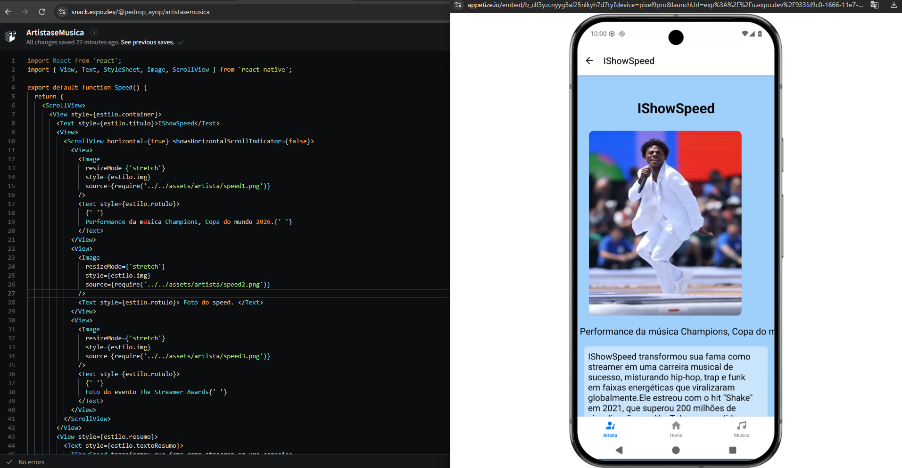
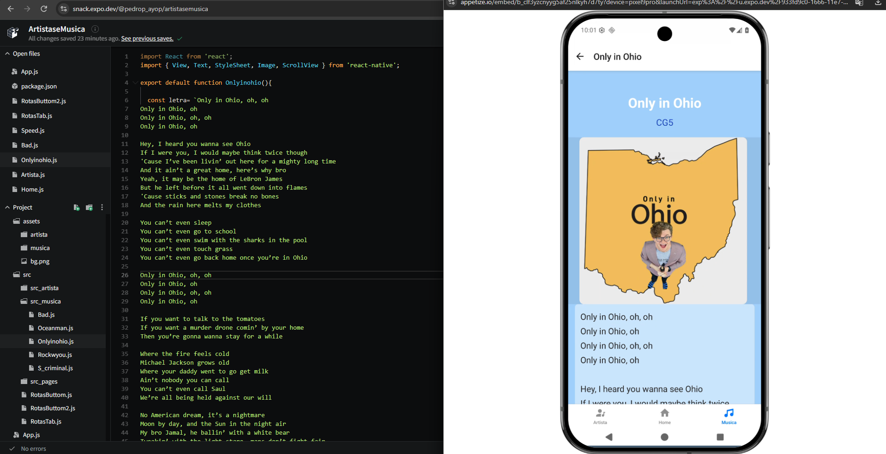

# 🎵 Artistas e Música

## 📱 Sobre o Projeto

**Artistas e Música** é um projeto desenvolvido pelo aluno **Pedro Paulo Costa Lisboa** como atividade acadêmica na **Etec de Guarulhos**, no curso de **Informática para Internet**.

O projeto foi desenvolvido utilizando **React Native e Expo**, com o objetivo de colocar em prática conceitos de desenvolvimento de aplicações mobile, criação de interfaces e organização de componentes.

### 🎵 Objetivo

A atividade teve como proposta desenvolver uma aplicação relacionada ao universo da **música e dos artistas**, permitindo aplicar na prática os conhecimentos adquiridos durante o curso.

### 🛠️ Tecnologias

- **React Native**
- **Expo**
- **JavaScript**
- **Expo Snack**

### 🎓 Informações Acadêmicas

- **Aluno:** Pedro Paulo Costa Lisboa
- **Instituição:** Etec de Guarulhos
- **Curso:** Informática para Internet
- **Tipo:** Atividade acadêmica

### ▶️ Acessar o Projeto

  <a href="https://snack.expo.dev/@pedrop_ayop/artistasemusica">
    🎵 <strong>Acessar o projeto no Expo Snack</strong>
  </a>

---

## 📸 Imagens do Projeto

  
  

  
  

  
  

---

## 👨‍💻 Desenvolvedor

**Pedro Paulo Costa Lisboa**

Projeto desenvolvido como atividade acadêmica do curso de **Informática para Internet — Etec de Guarulhos**.
